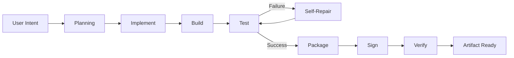

# VEYTRIX — Autonomous Engineering Control

VEYTRIX is the dedicated GitHub Autopilot / autonomous engineering control surface inside the NexusNova ecosystem. It is intentionally isolated under `veytrix/` so the existing NexusNova application, Android build system, Firebase wiring, and established QA infrastructure remain untouched.

## Integration architecture

The source branch was audited before implementation. The existing repository uses a lightweight Node static server (`server.js`) and the `fresh-rebuild/` web application, with modular JavaScript under `fresh-rebuild/src/`, extensive CSS assets, and a substantial Android project under `NexusNovaAndroid/`. Existing engineering instructions identify `fahadsoomro123/nexusnova-app` as the private development source of truth and explicitly route sensitive/laptop/device work to the private repository. VEYTRIX therefore lives as an additive standalone product at `/veytrix/` rather than replacing the existing `index.html` or NexusNova runtime.

## Design philosophy

- Command-first, not analytics-first.
- Evidence before claims.
- Dense information hierarchy without dashboard clutter.
- Dark technical canvas with restrained surfaces and a distinct violet brand accent.
- Status is communicated with text + icon + colour, never colour alone.
- Secondary information uses internal scroll areas, drawers, and progressive disclosure.
- No decorative analytics, fake uptime, fake accuracy, or fabricated GitHub telemetry.

## Colour system

VEYTRIX uses a new neutral/indigo-violet system defined in `css/tokens.css`. It does not reuse the rejected warm ivory/terracotta palette. Brand accent is `--vx-brand`; success, warning, error and info are separate semantic channels.

## Typography and spacing

UI typography is 15px by default, with 12px monospace technical identifiers. Layout tokens follow a 4/8/12/16/20/24/32/40 rhythm. Interactive controls use a minimum 44px height, with primary controls generally 48px+.

## Navigation

Primary bottom navigation: Home, Mission, Build, Artifacts, History.

Secondary workspaces: Projects, Self-Healing, Verification, GitHub, Security.

Desktop exposes the full control rail. Mobile collapses it into a drawer while retaining the five primary destinations at the bottom.

## State machine

```text
IDLE → PLANNING → IMPLEMENTING → BUILDING → TESTING → FAILED
FAILED → REPAIRING → RETESTING → VERIFYING
VERIFYING → VERIFIED → DELIVERED
```

The UI derives the execution rail, controls, logs, recovery surface and proof-line from the state model in `js/state.js`. The demonstration failure is explicit fixture state; it is not presented as a real repository failure.

## Signature components

### Nexus Execution Rail
Plan → Implement → Build → Test → Repair → Verify → Artifact.

### Verification Proof-Line
SOURCE → BUILD → TEST → SIGN → HASH → ARTIFACT.

### Artifact Fingerprint
A dedicated integrity surface that refuses to invent an APK name, signature, SHA-256, or artifact identity when no real artifact evidence is connected.

## Command grammar

Supported command suggestions include Build APK, Run tests, Repair failing tests, Verify latest artifact, Inspect failed build, Create release, Check GitHub, Fetch changes and Run verification.

## GitHub truth model

The standalone shell knows the configured repository and source branch because they are product configuration. Live PR state, CI state, changed files, live commit telemetry, and artifact evidence are **not** fabricated. Those fields explicitly remain unavailable until a connected runtime supplies evidence.

## Mermaid architecture



## QA methodology

`qa_report.md` records static/source-level checks that can be established from repository content. A dedicated workflow is included at `.github/workflows/veytrix-qa.yml` for branch execution. Browser rendering and screenshot inspection are only marked PASS when a real browser runtime produces the output; otherwise the report explicitly marks them NOT VERIFIED.

## Launch

From the repository root:

```bash
node server.js
```

Then open `/veytrix/` on the running server. The existing NexusNova entry point remains unchanged.

## Screenshot inventory

Required target inventory is:

```text
screenshots/
  home.png
  mission.png
  projects.png
  build.png
  self-heal.png
  artifact.png
  history.png
  verification.png
  github.png
  security.png
```

This implementation does not claim these screenshots exist until an actual rendering runtime has generated and inspected them.
